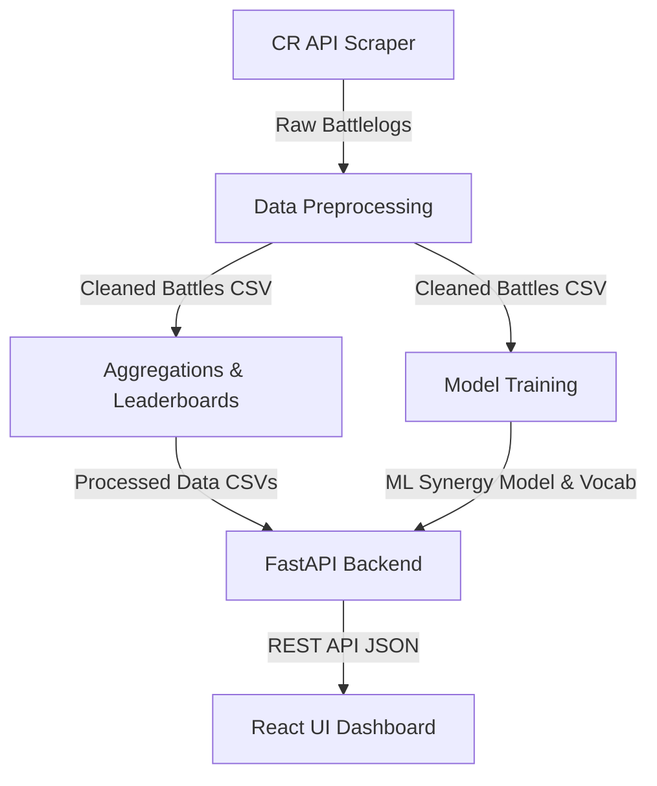

# Clash Royale Deck Analytics

A clean, full-stack application that provides Clash Royale deck ranking, card stats, matchup predictions, and deck evaluation using machine learning synergy models.

---

## 🌟 Features

* **Dashboard & Stats:** Real-time summary metrics, top-performing decks, card usage statistics, and ML model loaded status.
* **Deck Leaderboard:** Performance ranking of popular decks with filtering options and Wilson score intervals for statistical validation.
* **Card Analytics:** Popularity and win rate analysis mapping overperforming (overrated) or underperforming (underrated) cards in the current meta.
* **Deck Evaluator:** Input any custom 8-card combination to calculate its simulated win rate against the meta and receive optimal card swap recommendations.
* **Matchup Predictor:** Input two custom decks to predict win probability, analyze key match advantages/threats, and review card-by-card matchup contributions.

---

## 🛠️ Tech Stack

* **Frontend:** React, Vite, Tailwind CSS, Recharts, Lucide React.
* **Backend:** FastAPI, Uvicorn, Pandas, NumPy, Scikit-Learn.
* **Data & ML Pipeline:** Python scraper, Pandas preprocessing, Logistic Regression classification models for deck-vs-deck synergy prediction.

---

## 🔄 Data & Application Flow

1. **Ingestion:** The scraper (`api_scraper.py`) queries the official Clash Royale API using a seed player tag to crawl standard 1v1 ladder battles.
2. **Processing & Aggregation:** Raw battle logs are cleaned and preprocessed into structured CSV datasets representing battles, aggregated deck win rates, and card statistics.
3. **Model Training:** A machine learning synergy model (`train_synergy_model.py`) is trained on level-adjusted deck matchups to predict the win probability of one deck signature against another.
4. **API Services:** The FastAPI backend loads the trained model artifacts and processed datasets into memory on startup to serve fast, stateless REST endpoints.
5. **User Interface:** The responsive React dashboard consumes the API to display metadata leaderboards and run interactive deck simulations.
